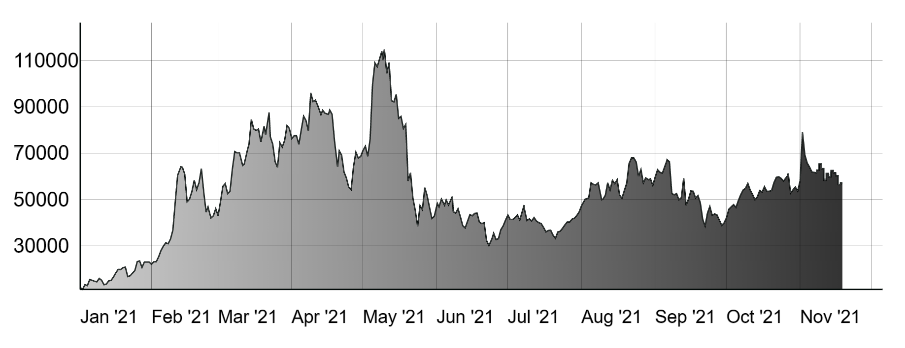

# svg-line-chart

[](https://badge.fury.io/js/svg-line-chart) [](https://github.com/TimDaub/svg-line-chart/actions/workflows/node.js.yml)

## Why?

- line-chart.js.br is only 34KB
  ([d3.min.js](https://cdnjs.cloudflare.com/ajax/libs/d3/6.6.2/d3.min.js) is
  264KB!)
- Just generates a `<svg>` line chart. NO EXTRA JS OR CSS.
- Responsiveness through `<svg>` tag
- Unit tests & Small code base
- Node.js & Browser

## Screenshot



## Installation

Works for browser and node.js.

```bash
$ npm i svg-line-chart vhtml htm
```

## Usage

A working example can be found in
[`./scripts/serve.mjs`](https://github.com/TimDaub/svg-line-chart/blob/master/scripts/serve.mjs).
                                                             
```js                                                        
import htm from "htm";
import vhtml from "vhtml";
const html = htm.bind(vhtml);

import { plot } from "svg-line-chart";

const x = ["2021-01-01T00:00:00.000Z","2021-01-02T00:00:00.000Z"];
const y = [0, 1];

const svgChart = plot(html)(
  { x, y },                                                  
  {                                                          
    margin: 10,                                              
    width: 70,                                               
    height: 35,                                              
    title: "A line chart",                                   
    line: {                                                  
      fill: "none",                                          
      strokeWidth: 0.1,                                      
      stroke: "black"                                        
    },                                                       
    xAxis: {                                                 
      strokeWidth: 0.1,                                      
      stroke: "black"                                        
    },                                                       
    yAxis: {                                                 
      strokeWidth: 0.1,                                      
      stroke: "black"                                        
    },                                                       
    xLabel: {                                                
      strokeWidth: 0.05,                                     
      stroke: "lightgrey",                                   
      fontSize: 1.5                                          
    },                                                       
    yLabel: {                                                
      strokeWidth: 0.05,                                     
      stroke: "lightgrey",                                   
      fontSize: 1.5                                          
    },                                                       
    yDistance: 50
  }
);
```

## Changelog

### 0.1.0

- Release targeted bundles for node14 and browsers (minified)
- Breaking change: Separate `htm` and `vhtml` as `peerDependencies`
- Switch from `microbundle` to `esbuild`

### 0.0.4

- Target node again

### 0.0.3

- Target node

### 0.0.2

- Improve axis and line rendering through proper render-order

### 0.0.1

- Initial release

## License

See [License](./LICENSE).

## References

- https://css-tricks.com/how-to-make-charts-with-svg/
